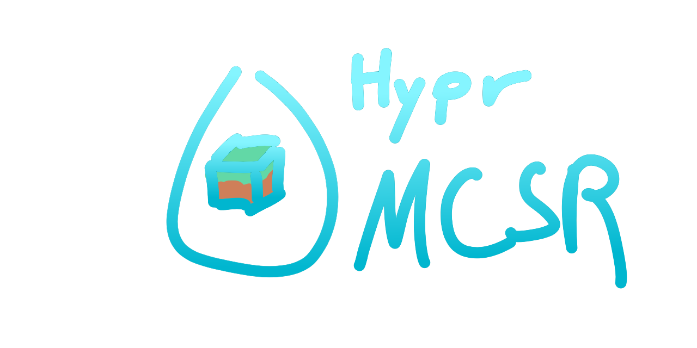

# hyprmcsr

> **Note:**  
> This project and its documentation are still experimental and under active development.  
> [See the full documentation and guide in the `docs/` folder.](./docs/README.md)

> **Disclaimer:**
> This README and parts of the automation were created with help from [GitHub Copilot](https://github.com/features/copilot).

## Overview

**hyprmcsr** is a toolkit for automating a modern Minecraft speedrunning environment on Linux, with a focus on performance, usability, and automation.  
It is especially useful for runners looking for a streamlined, performant alternative to the typical Windows-based MCSR setup.

The toolkit leverages [Hyprland](https://hyprland.org/) (Wayland compositor), Pipewire, PrismLauncher, and various helper tools to provide:
- Automated window management and keybinds
- Audio splitting for game/Discord/OBS
- Input remapping for optimal controls
- Easy mod and tool management (auto-download)
- Integration with OBS and other speedrun helpers

All core functionality is controlled via the `hyprmcsr` CLI, which manages setup, teardown, and automation for your speedrun sessions.

---

## Documentation

For setup instructions, usage, and all details, see the  
👉 **[Full Guide & Documentation](./docs/README.md)** 👈

---

## Contributers

- Me ([youtube](https://www.youtube.com/@relacibo), [speedrun.com](https://www.speedrun.com/de-DE/users/Relacibo))
- [Igelway](https://github.com/Igelway) ([youtube](https://www.youtube.com/@MisterKenway), [speedrun.com](https://www.speedrun.com/de-DE/users/Igelway))

## License

- All project code is under the [MIT License](LICENSE).
- Some components (like obs-vkcapture, InputRemapper) have their own licenses—see the respective files.

---

**Questions or issues?**  
Check the script comments or [open an issue](https://github.com/Relacibo/hyprmcsr/issues)!
